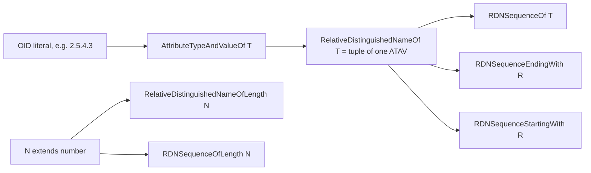

# Attribute-type brands for the `dn` package

## Design

The only brand is a phantom property on the ATAV, keyed by its OID in dotted-decimal form. RDN and DN types are plain tuple types built over branded ATAVs, so they need no brands of their own. You can extend the scheme to any attribute by writing `AttributeTypeAndValueOf<"1.2.3.4">`. No registry or declaration merging is needed.



An in-memory `tsc` 6.0.2 check confirmed the following:
- `AttributeTypeAndValueOf<"2.5.4.3"> & AttributeTypeAndValueOf<"2.5.4.6">` reduces to `never`. Narrowing an already-branded ATAV with a guard for a different OID also gives `never`.
- `AttributeTypeAndValueOf<string>` and `AttributeTypeAndValueOf<"commonName">` are compile errors, because the type parameter is constrained to a template-literal OID string.
- A tuple like `[CommonNameATAV]` can be assigned to `RelativeDistinguishedName`, but a plain `RelativeDistinguishedName` cannot be assigned to it.
- RDN tuples of different types cannot be assigned to each other. Their intersection is not reduced to `never`, but its element 0 is `never`. This is accepted, per your choice of structural RDN types.

## Types in [packages/dn/src/lib/brands.mts](packages/dn/src/lib/brands.mts)

```ts
declare const attributeType: unique symbol;

export type ObjectIdentifierString = `${number}.${string}`;

export type AttributeTypeAndValueOf<T extends ObjectIdentifierString> =
    AttributeTypeAndValue & { readonly [attributeType]: T };

export type RelativeDistinguishedNameOf<T extends ObjectIdentifierString> =
    [AttributeTypeAndValueOf<T>];

export type FixedLengthArray<E, N extends number, Acc extends E[] = []> =
    number extends N ? E[] : Acc["length"] extends N ? Acc : FixedLengthArray<E, N, [...Acc, E]>;

export type RelativeDistinguishedNameOfLength<N extends number> = FixedLengthArray<AttributeTypeAndValue, N>;
export type RDNSequenceOfLength<N extends number> = FixedLengthArray<RelativeDistinguishedName, N>;
export type RDNSequenceOf<T extends ObjectIdentifierString> = RelativeDistinguishedNameOf<T>[];
export type RDNSequenceStartingWith<R extends RelativeDistinguishedName> = [R, ...RelativeDistinguishedName[]];
export type RDNSequenceEndingWith<R extends RelativeDistinguishedName> = [...RelativeDistinguishedName[], R];
```

- If `T` is a union, the type means any one of those types. For example, `RDNSequenceOf<typeof oidC1OID | typeof oidC2OID | typeof oidCOID>` is a DN that uses only the `oidC*` attributes.
- "Starting" and "ending" refer to array positions and ignore DIT order. The JSDoc will say that in X.500 (DIT descending) order the last RDN is the entry's own RDN, and that you can intersect these types with `RDNSequenceDescending` or `RDNSequenceAscending`.
- `RelativeDistinguishedNameOfLength<0>` is allowed because you asked for length 0. The JSDoc will note that X.501 requires `SIZE (1..MAX)` for an RDN.

## OID constants and named aliases: new file [packages/dn/src/lib/attributeTypes.mts](packages/dn/src/lib/attributeTypes.mts)

Each OID is a `const` string literal, and each gets `XATAV` and `XRDN` aliases. For example:

```ts
export const commonNameOID = "2.5.4.3";
export type CommonNameATAV = AttributeTypeAndValueOf<typeof commonNameOID>;
export type CommonNameRDN = RelativeDistinguishedNameOf<typeof commonNameOID>;
```

This covers the following attributes:
- `commonName` (2.5.4.3), `surname` (2.5.4.4), `countryName` (2.5.4.6), `localityName` (2.5.4.7) and `stateOrProvinceName` (2.5.4.8)
- `organizationName` (2.5.4.10), `organizationalUnitName` (2.5.4.11), `givenName` (2.5.4.42) and `urnC` (2.5.4.89)
- `uid` (0.9.2342.19200300.100.1.1) and `domainComponent` (0.9.2342.19200300.100.1.25)
- `oidC` (2.17.1.2.2), plus `oidC1` (2.17.1.2.0) and `oidC2` (2.17.1.2.1), which the future OID-conversion work will need. The values come from X.520 lines 1963 to 1965.

There are also two DN-level aliases:
- `DomainComponentRDNSequence = RDNSequenceOf<typeof domainComponentOID>`
- `ObjectIdentifierComponentRDNSequence = RDNSequenceOf<typeof oidC1OID | typeof oidC2OID | typeof oidCOID>`

The file's JSDoc will show how to extend the scheme with your own OIDs.

## Type guards

Every guard that takes OIDs accepts `types: T | readonly T[]` and compares each against `atav.type_.toString()` (the canonical dotted-decimal string). Guards do not copy or change their input; they only narrow its type.

- New file [packages/dn/src/lib/atav/brand.mts](packages/dn/src/lib/atav/brand.mts) adds `isAttributeTypeAndValueOf(atav, types): atav is AttributeTypeAndValueOf<T>`.
- New file [packages/dn/src/lib/rdn/brand.mts](packages/dn/src/lib/rdn/brand.mts) adds:
  - `isRelativeDistinguishedNameOf(rdn, types)`, which checks that the RDN has length 1 and that its ATAV matches.
  - `isRelativeDistinguishedNameOfLength(rdn, length)`.
- New file [packages/dn/src/lib/rdnseq/brand.mts](packages/dn/src/lib/rdnseq/brand.mts) adds:
  - `isRDNSequenceOfLength(dn, length)`.
  - `isRDNSequenceOf(dn, types)`. Every RDN must be a single-ATAV RDN of one of the types. An empty DN passes.
  - `isRDNSequenceStartingWith(dn, types)` and `isRDNSequenceEndingWith(dn, types)`, which narrow to `RDNSequenceStartingWith<RelativeDistinguishedNameOf<T>>` or `RDNSequenceEndingWith<...>`. An empty DN fails.

The guards narrow by intersection, so existing brands such as `RDNSequenceDescending` are kept.

## Exports and tests

- [packages/dn/src/index.ts](packages/dn/src/index.ts) will export the new types from `brands.mjs`, all constants and aliases from `attributeTypes.mjs`, and the guards.
- New spec files `atav/brand.spec.mts`, `rdn/brand.spec.mts`, `rdnseq/brand.spec.mts` and `attributeTypes.spec.mts` will follow the `expectTypeOf` style of [packages/dn/src/lib/brands.spec.mts](packages/dn/src/lib/brands.spec.mts). They will cover:
  - Mutual exclusivity: the ATAV intersection is `never`, and RDNs of different types are not assignable to each other.
  - `@ts-expect-error` for non-OID brand parameters.
  - Narrowing, including narrowing to `never` on a conflicting OID.
  - Runtime true and false cases. ATAVs will be built with `new AttributeTypeAndValue(id_at_commonName, ...)`, using the existing OID constants in `atav/distinguishedTypeToString.mts`.
  - Lengths 0 and 3 for both RDNs and DNs.
  - Union-typed `isRDNSequenceOf` for the `oidC*` attributes.
  - Keeping an order brand through narrowing.
  - A unit test checking each string constant against the `toString()` of the matching `OBJECT_IDENTIFIER` constant.
- To verify, run `npx nx test dn` and `npx nx build dn`.

## Out of scope

I'll leave `asDITAscending`/`toDITAscending` in `rdnseq/order.mts` unchanged. Making them generic, so they keep tuple structure and swap "starting with" and "ending with" when the order is reversed, is a separate follow-up.
