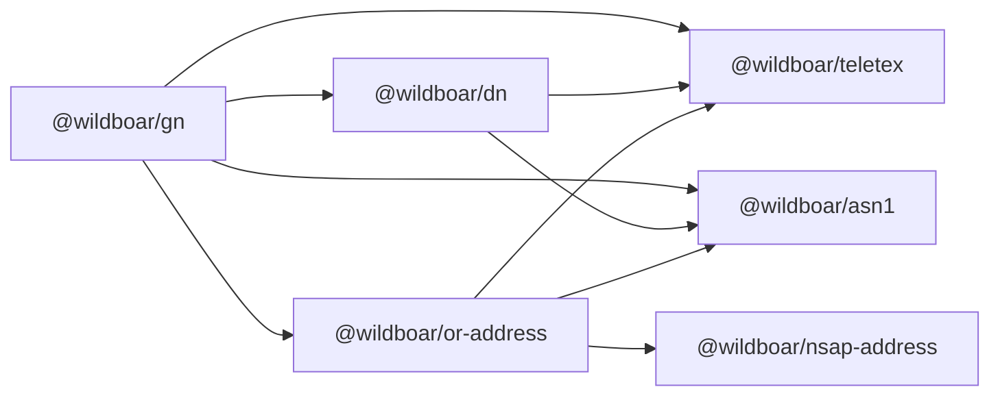

# `@wildboar/gn` package build-out

## Starting point

Most of `packages/gn` is already in place from commit `089d57f04`. It has the codecs (`GeneralName`, `GeneralNames`, `EDIPartyName`, `UnboundedDirectoryString`), comparison, a basic stringifier, `stringifyOtherName`, the JSON helpers for `UnboundedDirectoryString`, and `GeneralNameTrie`. What's missing or broken:

- The package config is still the Nx template. `src/index.ts` exports a missing `./lib/gn.js`, there is no `project.json` or `jsr.json`, and the tsconfig is loose.
- The code doesn't yet meet `dn`'s strict tsconfig. The goal is to improve the code until it passes those settings. The settings themselves won't be loosened, and no `@ts-ignore`, `any` casts or other suppressions will be added to get around them. The problems I already know of are:
  - unused imports in `GeneralNames.ta.mts`;
  - value imports of types in `UnboundedDirectoryString.ta.mts`, which `verbatimModuleSyntax` rejects;
  - constructor parameter properties in `EDIPartyName`, which `erasableSyntaxOnly` rejects.

  The strict build may find more. Each one will be fixed properly too: explicit return types where `isolatedDeclarations` requires them, real handling of `undefined` under `strictNullChecks` and `exactOptionalPropertyTypes`, and bracket access under `noPropertyAccessFromIndexSignature`.
- There are known bugs:
  - `dNSName` prints with a stray `}`.
  - IPv6 addresses are joined with `.`.
  - `stringifyOtherName` uses the global `Buffer` without importing it.
  - `_encode_GeneralNames` ignores its encoder and always produces DER.
- The code depends on two packages it must not use:
  - `stringifyOtherName.mts` imports `_decode_AlgorithmIdentifier` from `@wildboar/pki-stub`. The package isn't even declared in `package.json`.
  - `GeneralNameTrie.spec.ts` imports `commonName` and `surname` from `@wildboar/x500`.

## Scope

Every edit stays inside `packages/gn`. Nothing in `x500`, `dn`, `or-address`, `pki-stub`, the root config or `.github` is modified. That includes `x500`'s own GeneralName stringifiers, comparators and `EqualityMatcher`, which stay where they are for now. Code that used to come from those packages is either copied into `gn` or reimplemented there.

## Target dependencies

`@wildboar/gn` must not depend on `@wildboar/pki-stub` or `@wildboar/x500`. That covers runtime, `package.json`, `jsr.json` and test code. Both of those packages sit above `gn`: `pki-stub` has its own `GeneralName` and `x500` has GeneralName stringifiers and comparators, so either may later depend on `gn`, and importing them would create a cycle. Here is how each import goes away:

- **`pki-stub`:** `gn` only uses `pki-stub` in one place. When `otherNameToString` prints a Subject Identification Method (SIM) `otherName` (RFC 4683), it has to read the SIM's first field, `hashAlg`, which is an `AlgorithmIdentifier`. Today it calls `pki-stub`'s `_decode_AlgorithmIdentifier`, but the only output it needs is the algorithm OID and whether parameters are absent or `NULL`. So I'll replace that call with a few lines that read the `hashAlg` element directly with `@wildboar/asn1`:
  - `hashAlg.sequence[0].objectIdentifier` for the algorithm;
  - `hashAlg.sequence[1]`, if present, for the parameters, which must be `NULL`.
  
  Any other shape falls back to the existing "unknown or malformed `otherName`" hex output, the same as when the `pki-stub` decoder throws today.
- **`x500`:** the trie spec defines the `commonName` (2.5.4.3) and `surname` (2.5.4.4) OIDs locally and encodes values with `_encodePrintableString` from `@wildboar/asn1/functional`, as `dn`'s specs do.
- **`EqualityMatcher`:** only `gn`'s own copy, `packages/gn/src/lib/EqualityMatcher.mts`, is deleted, in favor of `dn`'s `GetDistinguishedValueMatcher`. The original in `x500` is left alone.

The only allowed dependencies are the ones shown below. Anything else counts as a regression. Verification includes `rg "@wildboar/(pki-stub|x500)" packages/gn`, which must return nothing.

## 1. Package and build configuration (copied from `dn`)

- [packages/gn/package.json](packages/gn/package.json):
  - Write `gn`'s own metadata rather than copying `dn`'s:
    - `"name": "@wildboar/gn"`, `"version": "1.0.0"`, `"private": false`, `"license": "MIT"`.
    - `"description"`: "X.509 / PKIX general names (`GeneralName`, `GeneralNames`) and related functionality".
    - `"keywords"`: `x.509`, `pkix`, `generalname`, `general-name`, `subjectaltname`, `san`, `x.500`.
    - `"homepage"`: this package's README, `https://github.com/Wildboar-Software/asn1-typescript-libraries/blob/master/packages/gn/README.md`. `dn` points at the monorepo's root README instead.
    - `"repository"`: the same git URL as `dn`, plus `"directory": "packages/gn"`.
    - `"bugs"`: the same email as `dn`, plus `"url"`: `https://github.com/Wildboar-Software/asn1-typescript-libraries/issues`.
    - `"author"` and `"contributors"`: the same person as `dn`, since it's the same author.
  - `jsr.json` uses the same name, version and license, so the two files agree.
  - Use the same `exports` and `main` layout as `dn`, pointing at `./src/index.js`.
  - Dependencies are `@wildboar/asn1`, `@wildboar/dn`, `@wildboar/or-address` and `@wildboar/teletex`, all as `npm:@jsr/...` specs. Drop `tslib`, and don't add `pki-stub` or `x500` (see "Target dependencies").
  - Don't run `npm install`, because it would rewrite the root `package-lock.json`. Building and testing don't need it: `node_modules/@wildboar/gn`, `dn`, `or-address` and `teletex` are already workspace symlinks. The lockfile entry for `gn` will be out of date, though, so `npm ci` may complain until you update it.
- New [packages/gn/jsr.json](packages/gn/jsr.json), [packages/gn/project.json](packages/gn/project.json) (the `@nx/js:tsc` build to `dist/packages/gn`) and `LICENSE.txt`, modeled on `dn`'s, with `gn`'s own paths and names.
- [packages/gn/tsconfig.lib.json](packages/gn/tsconfig.lib.json) and [packages/gn/tsconfig.spec.json](packages/gn/tsconfig.spec.json): use `dn`'s strict options (`isolatedDeclarations`, `exactOptionalPropertyTypes`, `verbatimModuleSyntax`, `erasableSyntaxOnly`, and so on) and output under `../../dist/...`. Also exclude and include `*.spec.mts`.
- `.github/workflows/publish.yml` stays as it is (it currently publishes only `dn`).

## 2. Source layout

Everything lives directly in `src/lib`, with no subfolders. Each file covers one concern and has a `.spec.mts` next to it.

- **`EDIPartyName`** is a class, so all of its functionality is a method on it, in `EDIPartyName.ta.mts`. There are no standalone EDIPartyName functions.
- **`GeneralName`** is a union type, so it can't have methods. Its functionality is standalone functions, one file per concern, such as `generalNameToString.mts`.
- **`GeneralNames`** is just an array of `GeneralName`, so it gets nothing beyond the existing `_encode_GeneralNames` and `_decode_GeneralNames`. Callers can use array methods with the `GeneralName` functions, for example `gns.map(generalNameToString)`.

### `EDIPartyName.ta.mts` (one file, methods only)

Keep the codec and component specs, declare the fields explicitly as `dn`'s `AttributeTypeAndValue` does (as `erasableSyntaxOnly` requires), and make `_encode_EDIPartyName` accept `elGetter`. Then add these methods:

- `toString(): string`, giving `{ nameAssigner:"...", partyName:"..." }`. `nameAssigner` is left out when absent.
- `toASN1String(): string`, giving value notation such as `{ nameAssigner uTF8String : "X", partyName printableString : "Y" }`, with strings quoted and `"` doubled.
- `toJSON(): EDIPartyNameJSON` and `static fromJSON(json): EDIPartyName`, which already exist and are kept. The JSON is lossless, so there is no separate `toJER`.
- `toKey(): string`, for many-to-many comparison, where allocation is expected. Both strings are case-folded with `dn`'s `prepString`, and the result is `JSON.stringify` of `[nameAssigner ?? null, partyName]`, which is unambiguous.
- `isEqualTo(other: EDIPartyName): boolean`, for one-to-one comparison with as little allocation as possible. A missing `nameAssigner` matches only another missing one.
  - It tries these checks in order, using the first that applies:
    1. If both use the same string type and the raw strings are identical, they're equal, with no allocation.
    2. If both strings are ASCII, a fast path does what `prepString` with `caseFold` would do for ASCII. It's either an inline loop or `toLowerCase`-based, whichever the benchmark shows is faster: it folds `A`-`Z`, ignores leading and trailing spaces, and treats each run of internal spaces as one.
    3. Otherwise, for non-ASCII or `teletexString`, it falls back to comparing `prepString` output, which allocates.
  - Its result must always match `toKey()` equality, and the spec checks this.
- `getEncodedLength(): number`, computed without encoding. It works out the byte length for each string type (UTF-8, Printable, BMP at 2 bytes per character, Universal at 4, Teletex), wraps each string in its `[0]`/`[1]` tag, and adds any unrecognized extensions.

The `GeneralName` functions call these methods for the `ediPartyName` alternative.

### Other existing files to keep and fix

- `GeneralName.ta.mts`: the codec only.
- `GeneralNames.ta.mts`: switch to `$._decodeSequenceOf` / `$._encodeSequenceOf` so the encoder argument is respected.
- `UnboundedDirectoryString.ta.mts`: change the imports to `type` imports, and move the JSON helpers from `json.mts` and the string helper from `directoryStringToString.mts` into this file. `UnboundedDirectoryString` is a union type, so these stay as functions: `unboundedDirectoryStringToString`, `unboundedDirectoryStringToJSON` and `unboundedDirectoryStringFromJSON`.
- `compareElements.mts` becomes internal and uses `dn`'s `compareBytes` instead of `Buffer.compare`.

### Files to move or rename

- `stringifyOtherName.mts` becomes `otherNameToString.mts`, exported as `otherNameToString`. It returns only the value, without the `otherName:` prefix. It decodes `AlgorithmIdentifier` inline (`SEQUENCE { OID, ANY OPTIONAL }`), which removes the `pki-stub` dependency, and uses a pure hex helper.
- `GeneralNameTrie.ts` becomes `.mts`.

### Files to delete

All under `packages/gn/src/lib`:

- `EqualityMatcher.mts`. Use `dn`'s `GetDistinguishedValueMatcher` instead; `x500`'s untouched `EqualityMatcher` is still assignable to it, so `x500` callers will work later.
- `json.mts` and `directoryStringToString.mts`, which are merged into `UnboundedDirectoryString.ta.mts`.

- `compareGeneralNames.mts`, since `GeneralNames` gets no functions of its own.

`generalNameToString.mts` and `compareGeneralName.mts` keep their names and are rewritten in place.

### New internal helpers

- `hex.mts`, for bytes-to-hex and back.
- `encodedLength.mts`, a copy of `dn`'s `tlvLength` and `definiteElementLength`. `dn` doesn't export them.

### `GeneralName` functions (flat files in `src/lib`)

- **`generalNameToString.mts`.** The output is `alternative:value`:
  - `rfc822Name`, `dNSName`, `uniformResourceIdentifier`: the raw string.
  - `directoryName`: `dn`'s `rdnSequenceToString`, giving `directoryName:cn=Bob,c=US`, which matches the existing `x500` test.
  - `x400Address`: `ORAddress.toString()` (RFC 1685).
  - `ediPartyName`: `EDIPartyName.toString()`.
  - `iPAddress`: `ipAddressToString`, so a name-constraint range prints as e.g. `iPAddress:192.0.2.0/24`.
  - `registeredID`: the dotted OID.
  - `otherName`: `otherNameToString`.
  - An unrecognized alternative: `#` followed by the hex of the whole element.
- **`generalNameFromString.mts`.** A best-effort parser. It splits at the first `:` and accepts:
  - `rfc822Name`, `dNSName`, `uniformResourceIdentifier`, after checking the value is IA5;
  - `iPAddress`, via `ipAddressFromString`, so `iPAddress:192.0.2.0/24` gives the 8-octet range form;
  - `registeredID`;
  - `directoryName`, via `rdnSequenceFromStringX520`;
  - `x400Address`, via `ORAddress.fromString`.
  
  It throws `SyntaxError` for `otherName`, `ediPartyName`, unknown alternatives and malformed values. The docs will say it is not an exact inverse of `generalNameToString`.
- **`generalNameToASN1String.mts`.** The output is `alternative : value`:
  - strings are quoted, with `"` doubled;
  - `iPAddress` is written as `'..'H`;
  - `directoryName` uses `nameToASN1String`;
  - `ediPartyName` uses `EDIPartyName.toASN1String()`;
  - `otherName` is `{ type-id 1.2.3, value <el.toString()> }`;
  - `x400Address` and unrecognized alternatives use the encoded element's `toString()`. As in `dn`, the docs will call this "good enough" rather than strictly valid notation.
- **`generalNameToJSON.mts`.** It exports `generalNameToJSON`, `generalNameToJER` and `generalNameFromJSON`, and the types `GeneralNameJSON` and `GeneralNameJER`. The JSON form is a single-key object keyed by the alternative:
  - `otherName`: `{ "type-id": oid, value: "#hex" }` in JSON, with the value's `toJSON()` in JER.
  - `x400Address`: `ORAddress.toJSON()`, in both JSON and JER.
    - `generalNameFromJSON` turns it back into an `ORAddress` with `or-address`'s own `BuiltInStandardAttributes.fromJSON` and `BuiltInDomainDefinedAttribute.fromJSON`.
    - That works only when `"extension-attributes"` is absent or empty. `or-address` writes each extension value with the element's lossy `toJSON()`, so those values can't be rebuilt. `generalNameFromJSON` throws a `SyntaxError` saying so; it never silently drops the extensions.
    - The docs will mention this limit. A real `ORAddress.fromJSON` would belong in `or-address`, which is out of scope for now.
  - `directoryName`: `nameToJSON` in JSON and `nameToJER` in JER.
  - `ediPartyName`: `EDIPartyName.toJSON()` in both.
  - `iPAddress`: hex.
  - `registeredID`: the dotted OID.
  - IA5 alternatives: the plain string.
  - An unrecognized alternative: `{ "_unrecognized": "#hex" }`. The underscore can never appear in an ASN.1 identifier, so this can't collide with a real alternative.
- **`compareGeneralName.mts`, `compareGeneralName(a, b, getMatcher?)`.** This is for efficient one-to-one comparison with few or no allocations, as with `dn`'s `compareAttributeTypeAndValue`. The goal is speed, and avoiding allocations is a means to it, not a rule. So for each string-based alternative (`rfc822Name`, `dNSName`, `uniformResourceIdentifier`, and the ASCII path of `EDIPartyName.isEqualTo`), the benchmark decides between two implementations:
  - an index-scanning one using `charCodeAt` and inline ASCII case folding, with no allocation;
  - a simpler one using `toLowerCase`, `slice`, `lastIndexOf` and similar, which V8 often optimizes well for short strings.

  Whichever is faster on representative inputs is used, with a short comment recording the benchmark result. Either way, the result must be identical, which the key-agreement spec below checks. The one thing that stays ruled out is calling `generalNameToKey` from inside the comparison, because that would defeat the point of having a separate one-to-one function. Before anything else, it returns `false` as soon as the two alternatives differ. Rules that differ from the current code are marked "(RFC 5280)", because the current code compares those alternatives differently.
  - **`rfc822Name`** (RFC 5280): find the last `@` with `lastIndexOf`. The local parts are compared exactly, character by character, and the domains with an inline ASCII case-insensitive loop that folds only `A`-`Z`. The current code lowercases the whole address.
  - **`dNSName`:** check the lengths first, then the same ASCII case-insensitive loop.
  - **`uniformResourceIdentifier`** (RFC 5280 section 7.4): find the end of the scheme and the host span by index scanning. The host span is the authority after any `userinfo@`, up to the port, with IPv6 `[...]` handled. The scheme and host are compared ASCII case-insensitively and everything else exactly, without building any substrings. The current code lowercases the whole URI.
  - **`iPAddress`:** `dn`'s `compareBytes`, a plain loop. This works for 4/16-octet addresses and 8/32-octet ranges alike.
  - **`registeredID`:** `ObjectIdentifier.isEqualTo`.
  - **`directoryName`:** `dn`'s `compareName`, which is already designed to be low-allocation.
  - **`otherName`:** compare the type-ids with `isEqualTo`, then the values with `compareElements`. That compares the content bytes directly, and only deconstructs, which allocates, in the rare case where one string is primitive and the other constructed.
  - **Unrecognized alternatives:** `compareElements`, the same as `otherName` values.
  - **`ediPartyName`** (RFC 5280): `EDIPartyName.isEqualTo()`, described below. The current code compares raw strings.
  - **`x400Address`:** the one known exception, documented as such. `or-address` has no field-by-field equality and no retained encoding, so both values are DER-encoded and compared with `compareElements`. X.400 addresses in certificates are rare, so I'm accepting this rather than reimplementing `ORAddress` equality inside `gn`.
- **`generalNameToKey.mts`.** This is for many-to-many comparison, such as `Map` and `Set` keys, so building strings is expected and accepted. The key is the alternative, then `:`, then a normalized value, so keys from different alternatives can't collide. Each alternative is normalized exactly as `compareGeneralName` would compare it:
  - `rfc822Name`: the local part unchanged, `@`, and the domain lowercased.
  - `dNSName`: lowercased.
  - `uniformResourceIdentifier`: scheme and host lowercased, the rest unchanged.
  - `iPAddress`: hex.
  - `registeredID`: the dotted OID.
  - `directoryName`: `nameToKey`.
  - `ediPartyName`: `EDIPartyName.toKey()`.
  - `x400Address`: `#` followed by the hex of the DER encoding.
  - `otherName`: the type-id, then `#` followed by the hex of the value. A constructed universal string is deconstructed first, matching `compareElements`.
  - Unrecognized alternatives: `#` followed by hex, deconstructed in the same way.
- **The rule that ties them together:** `compareGeneralName(a, b)` must return the same result as `generalNameToKey(a) === generalNameToKey(b)` whenever no `getMatcher` is passed (`dn` states the same rule for its own pair). The spec tests this over a fixture set covering every alternative and every normalization edge case: case differences in each part of an email address or URI, an `@` in the local part, URIs with userinfo, ports or IPv6 hosts, IP ranges, primitive vs constructed strings, and an absent vs present `nameAssigner`.
- **`bench/compareGeneralName.mjs`.** A benchmark like `dn`'s `bench/compareAttributeTypeAndValue.mjs`, using the `benchmark` dev dependency against the built `dist` output. It lives inside `packages/gn` and isn't part of the build. It does two jobs:
  - **Choosing implementations.** For each string-based alternative it times the index-scanning version against the `toLowerCase`/`slice` version, with equal, case-differing and unequal inputs at typical lengths. The faster one goes into `compareGeneralName`. The benchmark is run before those comparisons are finalized.
  - **Justifying the API.** It times `compareGeneralName` against `generalNameToKey(a) === generalNameToKey(b)` for each alternative, to confirm that the one-to-one path really is faster.
- **`getGeneralNameEncodedLength.mts`.** It computes the length without encoding:
  - IA5 alternatives, `iPAddress` and `registeredID` use their byte lengths;
  - `directoryName` wraps `getNameEncodedLength` in the explicit `[4]` tag;
  - `otherName` computes the OID plus the `[0]`-tagged value;
  - `ediPartyName` uses `EDIPartyName.getEncodedLength()`.
  
  `x400Address` is the only alternative that has to be encoded to measure it, because `or-address` has no length calculator. The docs will say so.
- **`ipAddress.mts`.** `ipAddressToString` and `ipAddressFromString` support both forms of `iPAddress` from RFC 5280. The octet count tells them apart, so the caller doesn't need to say which form a value is in.
  - **A single address** (section 4.2.1.6, e.g. in `subjectAltName`):
    - 4 octets as dotted IPv4, such as `192.0.2.1`.
    - 16 octets as IPv6 per RFC 5952: lowercase hex, leading zeros dropped, the longest run of two or more zero groups compressed to `::` (leftmost on a tie), and IPv4-mapped addresses written as `::ffff:192.0.2.1`.
  - **An address range in name constraints** (section 4.2.1.10): the address octets followed by an equally long mask, in the style of RFC 4632 (CIDR):
    - 8 octets for IPv4. RFC 5280's own example is `C0 00 02 00 FF FF FF 00`, which is `192.0.2.0/24`.
    - 32 octets for IPv6, such as `2001:db8::/32`.
    - A contiguous mask is written as a prefix length (`/24`). RFC 4632 requires contiguous masks, but a non-contiguous one is still printed losslessly as an explicit mask (`192.0.2.0/255.0.255.0`, or a full IPv6 address for 32-octet values) rather than throwing.
    - Address bits outside the mask are printed as they are (`192.0.2.5/24`). They aren't silently zeroed, so printing never hides malformed data.
  - **Any other length** is written as `#` followed by hex, because it can't be a valid `iPAddress`.

  `ipAddressFromString` accepts every form above:
  - A bare IPv4 or IPv6 address, including `::` compression and an embedded dotted IPv4 tail, gives 4 or 16 octets.
  - `address/prefix` (0-32 for IPv4, 0-128 for IPv6) or `address/mask` gives 8 or 32 octets.
  - Anything else, such as a prefix out of range, a mix of IPv4 and IPv6, or bad syntax, throws `SyntaxError`.

  There is also a small internal helper for name constraints, `ipAddressRangeFromOctets(octets)`, which `ipAddressToString` uses. It isn't exported. For 8 or 32 octets it returns `{ address, mask, prefixLength }`, where `prefixLength` is `null` when the mask isn't contiguous. For any other length it returns `null`. Matching addresses against ranges isn't part of this package, since name-constraint matching is out of scope.

  The spec includes RFC 5280's example both ways (`C0 00 02 00 FF FF FF 00` ⇄ `192.0.2.0/24`) and the IPv6 equivalents. It also checks the RFC 5952 compression edge cases: a single zero group isn't compressed, the leftmost run wins a tie, and `::`, `::1` and IPv4-mapped addresses print correctly.
- **`GeneralNameTrie.mts`.**
  - Add JSDoc.
  - Fix the `first && (yield first)` bug, which drops falsy values such as `0`.
  - Keep the existing descent semantics.
  - In the spec (renamed `.spec.mts`), replace the `@wildboar/x500` imports with local OID constants and `_encodeUTF8String` / `_encodePrintableString`, and fix the bare `expect(x.has(...))` calls that assert nothing.

## 3. `src/index.ts`

Explicit named exports, the same style as `dn`'s index. The public API is:

- **Types:** `GeneralName`, `GeneralNames`, `EDIPartyName`, `UnboundedDirectoryString`, and the JSON types `GeneralNameJSON`, `GeneralNameJER`, `EDIPartyNameJSON` and `UnboundedDirectoryStringJSON`. That last one is exported as a type only, because `EDIPartyNameJSON` refers to it.
- **Codecs:** `_encode_` and `_decode_` for `GeneralName`, `GeneralNames`, `EDIPartyName` and `UnboundedDirectoryString`, plus `EDIPartyName`'s component specs.
- **`GeneralName` functions:** `generalNameToString`, `generalNameFromString`, `generalNameToASN1String`, `generalNameToJSON`, `generalNameToJER`, `generalNameFromJSON`, `generalNameToKey`, `compareGeneralName` and `getGeneralNameEncodedLength`.
- **`GeneralNameTrie`**.

The utility functions aren't exported. They're still unit-tested by their specs, which import the modules directly:

- `ipAddressToString`, `ipAddressFromString` and `ipAddressRangeFromOctets`;
- `otherNameToString`;
- `unboundedDirectoryStringToString`, `unboundedDirectoryStringToJSON` and `unboundedDirectoryStringFromJSON`;
- the internal helpers (hex conversion, `tlvLength` and `definiteElementLength`, `compareElements`, and the ASCII case-insensitive comparison helpers).

Callers get the same behavior through the public functions. For example, `generalNameToString({ iPAddress })` gives `iPAddress:192.0.2.0/24`, and `generalNameFromString("iPAddress:192.0.2.0/24")` gives the 8-octet form. The utility functions' JSDoc is marked `@internal`.

## 4. README

Rewrite [packages/gn/README.md](packages/gn/README.md) in `dn`'s structure:

- the intro (ESM-only, published on npm and JSR, its dependencies);
- the specifications (ITU-T X.509 GeneralName, RFC 5280 including the name-constraint `iPAddress` ranges, RFC 4632, RFC 5952, RFC 1685 for X.400);
- a feature list;
- a `## Showcase` block whose trailing comments show real output: to string and back, ASN.1 value notation, JSON/JER round-trip, keys and comparison, encoded length, IP addresses and name-constraint ranges (shown through `generalNameToString` and `generalNameFromString`, since the IP utilities aren't exported), and a `GeneralNameTrie` lookup;
- the AI usage statement.

The showcase output will be captured by running it against the build.

## 5. Verification

- `npx nx build gn`, which also type-checks. It must pass with `tsconfig.lib.json` identical to `dn`'s strict settings (apart from paths) and with no type-check suppressions in `src`.
- `npx nx test gn`.
- `rg "@wildboar/(pki-stub|x500)" packages/gn` returns nothing, and `npx nx graph --print` (or `nx show project gn`) lists only `dn`, `or-address`, `teletex` and their own dependencies.
- `git status` shows changes only under `packages/gn`, apart from your pre-existing uncommitted work. No other package depends on `gn`, so other packages don't need rebuilding or retesting.
