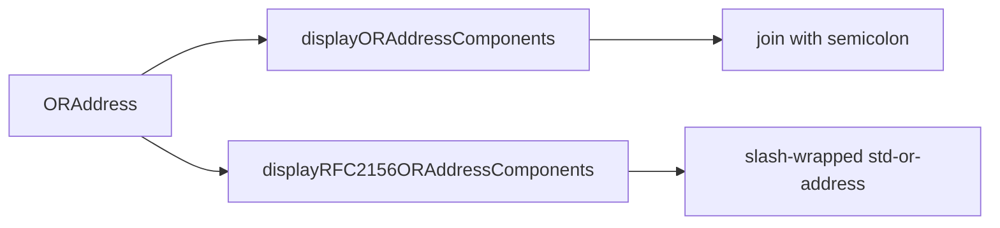

# Add RFC 2156 O/R Address Display

Keep every existing RFC 1685 `toString()` / `displayORAddressComponents()` path behaviorally unchanged. Add a parallel MIXER generation path (RFC 2156 §4.1) and thin `toRFC2156String()` methods that call it.

Parse already defaults to RFC 1685 and takes `{ rfc: 2156 }`. Display follows the same split: `toString()` stays RFC 1685; RFC 2156 is an explicit method.

## Public API

Leave existing `toString()` methods as RFC 1685.

Add `toRFC2156String(): string` on:

- [`ORAddress.ta.mts`](packages/or-address/src/lib/modules/PkiPmiExternalDataTypes/ORAddress.ta.mts) — join RFC 2156 components as `std-or-address`: `"/" + parts.join("/") + "/"`
- [`BuiltInStandardAttributes.ta.mts`](packages/or-address/src/lib/modules/PkiPmiExternalDataTypes/BuiltInStandardAttributes.ta.mts) — same wrapping over built-in attributes only (wrap `this` in an `ORAddress` and reuse the OR-address formatter, or call a dedicated helper)
- [`PersonalName.ta.mts`](packages/or-address/src/lib/modules/PkiPmiExternalDataTypes/PersonalName.ta.mts) — inverse of `fromRFC2156String`: `encoded-pn` when the §4.1.2 restrictions hold; otherwise `G=` / `I=` / `S=` / `GQ=` pairs (generation qualifier is not in `encoded-pn`)
- [`TeletexPersonalName.ta.mts`](packages/or-address/src/lib/modules/PkiPmiExternalDataTypes/TeletexPersonalName.ta.mts) — same shape, with teletex `{ddd}` encoding on each component
- [`UniversalPersonalName.ta.mts`](packages/or-address/src/lib/modules/PkiPmiExternalDataTypes/UniversalPersonalName.ta.mts) — `UniversalOrBMPString.toString()` (Unicode), then the same `encoded-pn` vs `G=`/`I=`/`S=`/`GQ=` choice

Add JSDoc on every new function, including internals.

On [`displayORAddressComponents`](packages/or-address/src/lib/display.mts): add JSDoc stating it is RFC 1685. Do not rename it (avoids call-site churn). Do not rewrite its body.

## RFC 2156 generation rules

Implement in [`packages/or-address/src/lib/display.mts`](packages/or-address/src/lib/display.mts). `$`-quoting can live in [`utils.mts`](packages/or-address/src/lib/utils.mts) next to the existing RFC 2156 unescape.

**Output form** (`std-or-address`): always `/` as separator, leading and trailing `/`. Generate primary keywords from §4.1.1, not the parse-only alternatives: `ADMD` not `A`, `PRMD` not `P`, `GQ` not `Q`, `X121` not `X.121`, `UA-ID` not `N-ID`, `NET-NUM` / `NET-SUB` / `NET-PSAP` not `ISDN` / `PSAP`, `PD-ADDRESS` not `PD-A1`–`PD-A6`, `DD.type` not `DDA:type`.

**Do not generate `PN` or bare `DD`.** Full-address display emits `G`, `I`, `S`, `GQ` separately. `PersonalName.toRFC2156String()` is the place that produces `encoded-pn` (`Marshall.M.T.Rose`).

**OU / DD order:** X.400 SEQUENCE is most-significant first. RFC 2156 appearance order is the reverse, so emit `OU` and `DD.*` from last to first.

**`$` quoting** on labels (DD types) and values: prefix `$`, `/`, and `=` with `$`. Also quote `*` in printable (non-teletex) values so MIXER `teletex-and-or-ps` is not triggered on display. Do not quote `;` (canonical output uses `/` only).

**P/T (`teletex-and-or-ps`):** `[printable]["*" teletex]`. If only printable, or teletex is the same printable string, emit printable only (`yen*{165}` when they differ; `yen` when they do not).

**Teletex bytes** (`Uint8Array` / `TeletexString`): for each octet, if it is non-control ASCII (0x20–0x7E) **except** `{` and `}` (those would start a `t61-encoded` run), emit the character; otherwise emit a zero-padded three-digit decimal run inside `{...}`. Adjacent unprintables share one pair of braces: byte 12 then 45 → `{012345}`; yen 0xA5 → `{165}`.

**UniversalString:** `UniversalOrBMPString.toString()` then `$`-quote. No `{ddd}`.

**Structured values:**

- Personal name on a full address: `G=` / `I=` / `S=` / `GQ=` with P/T encoding per component (printable built-in, else teletex extension bytes, else universal Unicode)
- Unformatted postal address: `PD-ADDRESS=line1|line2|line3[*teletex]`
- E.163/164: `NET-NUM=` and optional `NET-SUB=` from `e163_4_address.number_` / `sub_address` (do not use `ExtendedNetworkAddress_e163_4_address.toString()`, which already prefixes `ISDN=`)
- PSAP: `NET-PSAP=` + `PresentationAddress.toString()`
- `T-TY`: existing `term_type_to_str` labels (`g3fax`, …) so parse round-trips
- Country: ISO alpha-2 or X.121 DCC as stored (reuse the numeric→ISO mapping idea from `displayCountryNameValue`, but do not call that helper — it currently returns `C=?` for valid alpha-2 codes)

Walk `extension_attributes` in the RFC 2156 formatter the same way RFC 1685 does, but **keep teletex as bytes** until `encodeTeletexString`. Prefer printable, then teletex, then universal, combining printable+teletex into one P/T value when both exist.

Internal helpers (all JSDoc’d), roughly:

- `escapeRFC2156StdPrintable(s)`
- `encodeTeletexString(bytes: Uint8Array)`
- `formatTeletexAndOrPs(printable?: string, teletex?: Uint8Array)`
- `personalNameToRFC2156EncodedPn(name)` — `null` if §4.1.2 restrictions fail
- `displayRFC2156ORAddressComponents(address): string[]`
- `formatRFC2156Address(components): string`

## Tests

Create [`packages/or-address/src/lib/display.spec.mts`](packages/or-address/src/lib/display.spec.mts). Extend [`PersonalName.spec.mts`](packages/or-address/src/lib/modules/PkiPmiExternalDataTypes/PersonalName.spec.mts) for `toRFC2156String` / `fromRFC2156String` round-trips.

Happy path:

- `/G=Andy/S=Wharol/O=MMNY/ADMD=ATT/C=US/` round-trip through `orAddressFromString(..., { rfc: 2156 })` then `toRFC2156String()`
- `PersonalName`: `Marshall.Rose`, `M.T.Rose`, `Marshall.M.T.Rose`, surname-only `Rose`
- `BuiltInStandardAttributes.toRFC2156String()` for a mnemonic address without extensions

Escaping: `O=a/b` → `O=a$/b`; `=` and `$` in values; `DD.a=b=c` type/value quoting.

Structured:

- `PD-ADDRESS=The Dome|The Square|Richmond|England`
- `NET-NUM` + `NET-SUB` (ISDN number and subaddress)
- `NET-PSAP` with a presentation address
- Repeated `OU` reversed (SEQUENCE `[high, low]` displays as `/OU=low/OU=high/.../`)

Teletex: construct `TeletexPersonalName` with surname bytes including `0xA5` (yen) and assert `{165}` (and combined `{012345}` if easy). Do not rely on `orAddressFromString` for this — parse currently decodes T.61 to Unicode and may store a universal attribute.

Edge: generation qualifier → `GQ=` not inside `encoded-pn`; given name of length 1 cannot be `encoded-pn` (would parse as an initial).

Do not chase coverage of every PDS extension keyword.