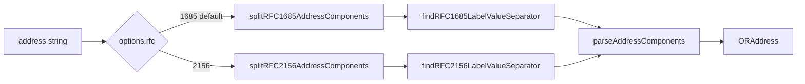

# Add RFC 2156 O/R Address Parsing

## Pipeline



Each RFC has a split generator (delimiter quoting) and a label/value separator finder. A thin generator uses the finder to slice each chunk into an abstract `[label, value]` pair (and undoes any remaining quoting in that pair). `parseAddressComponents()` does not know which RFC produced the pairs; it accepts **both** keyword sets, including compound RFC 2156 values (`PN`, `PD-ADDRESS`, repeated `OU` / `DD`).

## Public API

In [`packages/or-address/src/lib/parse.mts`](packages/or-address/src/lib/parse.mts):

```typescript
export type ORAddressStringSyntax = 1685 | 2156;

export interface ORAddressFromStringOptions {
    rfc?: ORAddressStringSyntax;
}

export function orAddressFromString(
    s: string,
    options: ORAddressFromStringOptions = {},
): ORAddress | null
```

- Default `rfc` is `1685` so existing callers stay RFC 1685.
- `builtInStandardAttributesFromString` gets the same options object, then returns `orAddressFromString(s, options)?.built_in_standard_attributes ?? null`.
- Export `parseAddressComponents(components: Iterable<readonly [string, string]>): ORAddress | null`.

When `rfc === 2156` and a country is present but no `ADMD`/`A`, inject `ADMD` with a single space **before** `parseAddressComponents` (RFC 2156 §4.1.3). Do not change RFC 1685’s current “missing ADMD stays missing” behavior.

## RFC-specific lexing in [`packages/or-address/src/lib/utils.mts`](packages/or-address/src/lib/utils.mts)

RFC 1685 already has both stages. Do **not** add `unescapeRFC1685Components`; rename the existing helpers and add the RFC 2156 analogs. Update all call sites in [`parse.mts`](packages/or-address/src/lib/parse.mts) and [`utils.spec.mts`](packages/or-address/src/lib/utils.spec.mts).

1. **Rename `splitORAddressComponents` → `splitRFC1685AddressComponents`**. Same behavior: split on a single delimiter (`/` or `;`); a doubled delimiter is not a split.

2. **Rename `findLabelValueSeparator` → `findRFC1685LabelValueSeparator`**. Same behavior: index of the first `=` that is not doubled (`==` is skipped so `DDA:foo==bar=value` splits after the type).

3. **`splitRFC2156AddressComponents(input)`** — yield chunks split on `/` **or** `;` (may mix). A `$` quotes the next character so `$/` and `$;` are not separators. Skip empty chunks from leading/trailing separators. `trimStart()` after each separator so `G=Andy; S=Wharol` works.

4. **`findRFC2156LabelValueSeparator(s)`** — RFC 2156 analog of `findRFC1685LabelValueSeparator`: index of the first `=` that is not quoted by `$`.

Thin generators (one per RFC) consume split chunks, call the matching `find*LabelValueSeparator`, and yield `[label, value]`:

- **RFC 1685:** slice at that index. Then: doubled delimiter (`;;` / `//`) only in the **value** (F.3.2.1); doubled `=` (`==`) only in the **DDA type** (`DDA:<type>`, F.3.2.3). Do **not** unescape `==` in values. Skip empty chunks (leading `/`).
- **RFC 2156:** slice at that index, then replace every `$` + char with that char on both label and value. A trailing `$` is invalid → entry point returns `null`.

Label-specific encodings (`PN` dots, `PD-ADDRESS` pipes, teletex `*` / `{ddd}`) stay in the abstract value for `parseAddressComponents`.

## Shared `parseAddressComponents`

Refactor the body of today’s `orAddressFromString` (the big `switch`) to consume `[label, value]` pairs. Normalize **keywords** case-insensitively (both RFCs allow this). Treat these as aliases of the same attribute:

- `ADMD` / `A`, `PRMD` / `P`, `GQ` / `Q`, `X121` / `X.121`, `UA-ID` / `N-ID`
- `PD-OFFICE-NUM` / `PD-OFFICE NUMBER` / `PD-OFN`, `PD-EXT-ADDRESS` / `PD-EA`, `PD-EXT-DELIVERY` / `PD-ED`
- `PD-OFFICE` / `PD-OF`, `PD-STREET` / `PD-S`, `PD-UNIQUE` / `PD-U`, `PD-LOCAL` / `PD-L`
- `PD-RESTANTE` / `PD-R`, `PD-BOX` / `PD-B`, `PD-CODE` / `PD-PC`, `PD-SERVICE` / `PD-SN`
- `DD` / `DDA`, `NET-NUM` / `E.164`, `NET-PSAP` / `PSAP`, `PD-ADDRESS` / `PD-A`

**Duplicates:** reject a second value for a given canonical attribute, except:

- Repeated `OU` (RFC 2156) — collect in appearance order, then **reverse** into the X.400 SEQUENCE so the rightmost `OU` is first (most significant), per RFC 2156 §4.3.3. If `OU1`–`OU4` are used, they are SEQUENCE order as today; mixing bare `OU` with `OU1`–`OU4` is invalid.
- Domain-defined attributes — `DD.type` / `DDA:type` / `DD:` may repeat; RFC 2156 `DD.*` appearance order is reversed into SEQUENCE for the same reason; RFC 1685 `DDA:` keeps appearance order (“processed in the sequence in which they are represented”). `DD1`–`DD4` are ordered numerically. `RFC-822=value` is DDA type `RFC-822`.

**Compound RFC 2156 values:**

- `PN` — parse with existing [`PersonalName.fromRFC2156String`](packages/or-address/src/lib/modules/PkiPmiExternalDataTypes/PersonalName.ta.mts) (`encoded-pn`). Incompatible with also having `G`/`I`/`S`. `GQ`/`Q` may still be supplied as a separate pair.
- `PD-ADDRESS` / `PD-A` — `upa-string`: printable lines split on `|`, optional `*` teletex part. Incompatible with `PD-A1`–`PD-A6`.
- `NET-NUM` + `NET-SUB` combine into one `extended_network_address`. Incompatible with `ISDN` / `PSAP` / `NET-PSAP`.

**P/T values:** after `$` unescape, interpret `teletex-and-or-ps` (`[printable]["*" teletex]`) for attributes whose encoding is P/T. Decode `{ddd}` (3 decimal digits → one T.61 octet) with `@wildboar/teletex`. Then keep the existing printable-vs-universal extension split in `orAddressFromString`. Numeric/labelled-integer attributes (`UA-ID`, `T-TY`, `X121`, …) do not use this.

Reuse the rest of the current mapping (common name, postal PDS extensions, `ISDN` heuristic split on `x`, `PresentationAddress.fromString` for PSAP, `term_type_from_str`). While moving this code, fix two bugs in the current RFC 1685 path:

- [`builtInStandardAttributesFromString`](packages/or-address/src/lib/parse.mts) parses `OU1`–`OU4` but never assigns `organizational_unit_names`.
- Postal code uses `postalCodeFromString(pd_pn)` instead of `pd_pc`.

## Tests

Add [`packages/or-address/src/lib/parse.spec.mts`](packages/or-address/src/lib/parse.spec.mts) and extend [`packages/or-address/src/lib/utils.spec.mts`](packages/or-address/src/lib/utils.spec.mts). Cover both the lexer helpers and `orAddressFromString` (with `{ rfc: 1685 }` default and `{ rfc: 2156 }`). Rename existing `findLabelValueSeparator` tests to the RFC 1685 name.

### Happy-path baselines

- RFC 1685: `G=Jonathan;I=M;S=Wilbur;O=Wildboar Software;A=123;C=US`
- RFC 2156: `/G=Andy/S=Wharol/O=MMNY/ADMD=ATT/C=us/`
- Keyword aliases: `UA-ID` vs `N-ID`, `ADMD` vs `A`, `PN=Marshall.M.T.Rose`, `PD-ADDRESS=The Dome|The Square|Richmond|England`, `DD.Title=Manager`
- RFC 2156 blank ADMD when `C` is present and `ADMD`/`A` is omitted
- RFC 2156 teletex-and-or-ps: `yen*{165}`
- Wrong `rfc`: `$`-quoted strings only parse with `rfc: 2156`; doubled-delimiter strings only unescape with `rfc: 1685`

### Escaping

RFC 1685:

- Doubled delimiter in a **value** (`O=a;;bank` → organization `a;bank`); not a component split
- `DDA:foo==bar=value` → type `foo=bar`, value `value` (`==` only in the DDA type)
- Literal `=` in a value (`O=foo=bar` → `foo=bar`); do not treat as escaped
- Slash form: `/O=a//b/C=US/` → organization `a/b`

RFC 2156:

- `$/` `$=` `$;` `$$` in values and in DDA types (`O=a$/b` → `a/b`; `DD.a$=b=c` → type `a=b`, value `c`)
- `$$/` is an escaped `$` then a real separator
- Trailing `$` with no following character is invalid (`null`)

Tripled / odd-length quoting:

- RFC 1685 `O=a;;;S=b`: the first two `;` are a doubled delimiter in the value; the third is a real separator → org `a;`, surname `b`
- RFC 1685 `O=a;;;;S=b` → org `a;;` then unescape to `a;`
- RFC 2156 `O=a$$$b` → `$` quotes `$`, then `$` quotes `b` → `a$b`
- RFC 2156 `O=a$$$$b` → `a$$b`

### Case sensitivity

- Keywords case-insensitive in both RFCs: `admd`, `Admd`, `PN`, `pn`, `dd.title`, `DDA:RFC-822`
- DDA **type** and attribute **values** keep the casing they were written with (`DD.Title=Manager` → type `Title`, value `Manager`)

### Whitespace

- Space after a delimiter before a label: `G=Andy; S=Wharol` (RFC 1685 F.3.2.1; RFC 2156 input)
- Leading `/` and optional trailing delimiter
- Leading/trailing spaces on the whole string
- `G =John` (space before `=`): treat as a non-keyword label (parse fails), not as `G`
- Do not trim interior spaces in values (`O=a bank ltd`)

### Mixed delimiters

- RFC 2156: `/G=Andy;S=Wharol/O=MMNY;ADMD=ATT/C=us/` parses
- RFC 1685: delimiter is chosen by whether the string starts with `/`; the other character is data, not a separator. `/G=Andy;S=Wharol/` is one malformed or unexpected component, not mixed pairs

### Ordering: OUs and domain-defined attributes

- RFC 2156 repeated `OU`: `/OU=low/OU=high/O=org/C=US/` → SEQUENCE `[high, low]` (rightmost is most significant)
- RFC 1685 `OU1`–`OU4`: numeric SEQUENCE order; missing earlier OU (`OU2` without `OU1`) fails
- Mixing bare `OU` with `OU1`–`OU4` fails
- RFC 2156 `DD.a=1/DD.b=2/...` (most significant on the right) reverses into SEQUENCE
- RFC 1685 `DDA:a=1;DDA:b=2` keeps appearance order
- `DD1`–`DD4` numeric order; two DDAs of the same type keep relative order per that RFC

### Invalid mixing of structured attributes

- `PD-ADDRESS` (or `PD-A`) together with any of `PD-A1`–`PD-A6` → `null`
- `PN` together with `G`, `I`, or `S` → `null`
- `PN` with a separate `GQ`/`Q` is allowed (generation qualifier is not in `encoded-pn`)
- `NET-NUM`/`ISDN`/`PSAP`/`NET-PSAP` combinations that name two network addresses → `null`

### Empty and zero-length

- `""`, `"/"`, `"///"`, `";;;"`, whitespace-only → `null`
- Zero-length label (`=value` or `/=US/`) → `null`
- Zero-length value (`G=` or `/G=/S=Smith/`) → `null` (attributes that require a non-empty string)
- Component with no `=` (`/G=John/Smith/`) → `null`

### Malformed structured values

- RFC 2156 `PN`: empty, trailing `.`, `..Rose`, non-PrintableString (`Marshall.Rosé`), given-name-too-short vs initials (`J.Smith` is initials, not a failure), `PersonalName.fromRFC2156String` throw → `orAddressFromString` returns `null`
- `PD-ADDRESS` with more than six `|`-separated printable lines → `null`
- Invalid country / non-numeric `UA-ID` / unknown `T-TY` / unparseable `PSAP` → `null`
- Unknown keyword → `null`
- Duplicate singleton keyword (`/C=US/C=GB/`) → `null`

No README expansion unless a short note on `{ rfc: 2156 }` is needed next to the existing RFC 1685 display section.